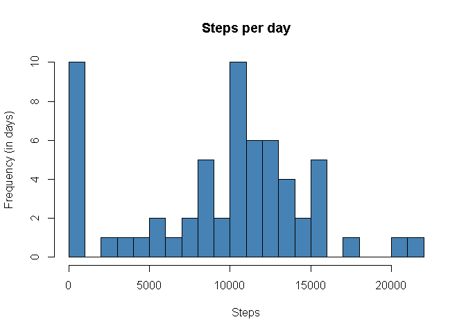
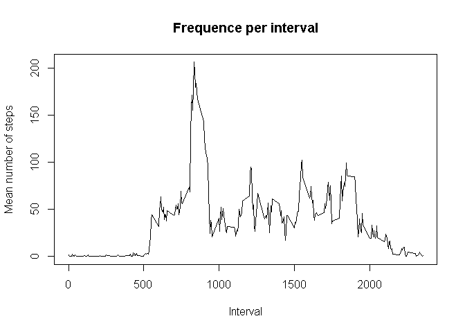
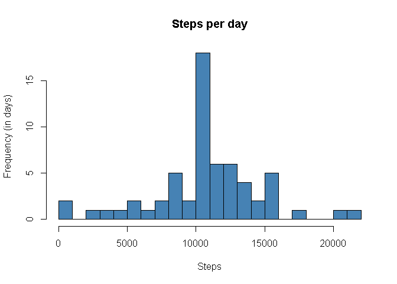
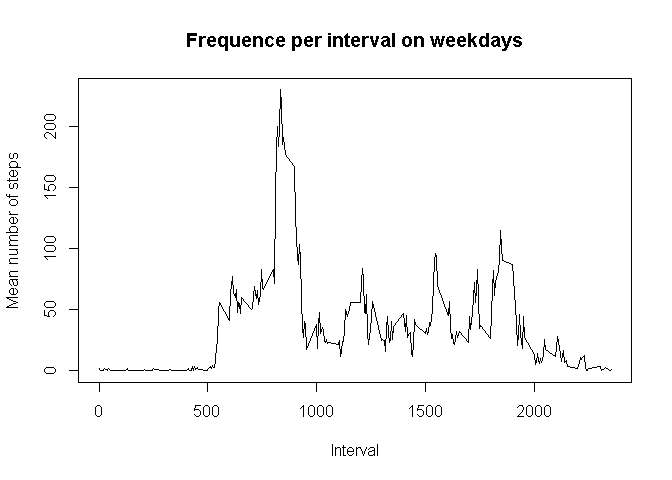
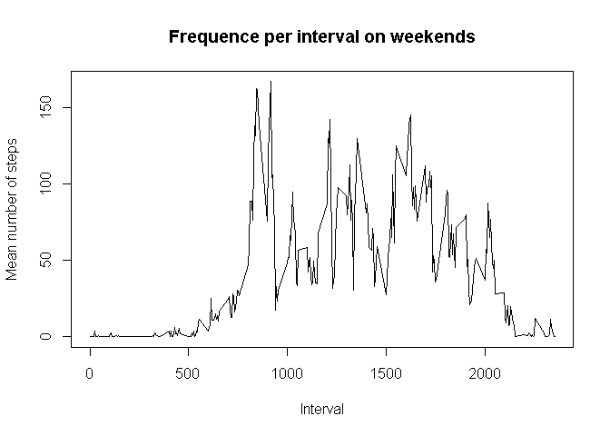

## Loading and preprocessing the data

First we load in our data set.

 
 ```r
 data<-read.csv("activity.csv")
 ```


## What is mean total number of steps taken per day?

We compute the sums of steps over each day, then compute the mean and median.

```r
stepsum<-tapply(data[,1],data[,2],sum, na.rm=TRUE)
mean(stepsum)
```

```
## [1] 9354.23
```

```r
median(stepsum)
```

```
## [1] 10395
```


## What is the average daily activity pattern?

We create the below to graphs. The histogram shows us the number of days we attain a certain number of steps. The line plot shows us the average number of steps per interval. Note for simplicity, the x-axis indicates the interval. We see the peak happens at interval 835, which a value of roughly 206.


```r
hist(stepsum, breaks=25,main="Steps per day", xlab = "Steps", ylab="Frequency (in days)",col="steelblue")
```

<!-- -->


```r
interval<-tapply(data[,1],data[,3],mean, na.rm=TRUE)
v<-data[1:288,3]
plot(v, interval, type="l", main="Frequence per interval", xlab="Interval", ylab="Mean number of steps")
```

<!-- -->

```r
which.max(interval)
```

```
## 835 
## 104
```

```r
interval["835"]
```

```
##      835 
## 206.1698
```
## Imputing missing values

First we find the number of na entries, and I create a new data frame incase we wish to reference the original.

```r
sum(is.na(data[,1]))
```

```
## [1] 2304
```

```r
newdata<-data
```
The below for loop imputes the missing data with the averages of the intervals. There's likely a cleaner way but it works! Comparing the below data with the above histogram, as well as the new means and medians, we see that imputing the data in this manner increases the means and median.

```r
for (i in 1:17568)
{
  newdata[i,1][is.na(newdata[i,1])]<-interval[as.character(newdata[i,3])]
}

newstepsum<-tapply(newdata[,1],newdata[,2],sum, na.rm=TRUE)
hist(newstepsum, breaks=25,main="Steps per day", xlab = "Steps", ylab="Frequency (in days)",col="steelblue")
```

<!-- -->

```r
mean(newstepsum)
```

```
## [1] 10766.19
```

```r
median(newstepsum)
```

```
## [1] 10766.19
```


## Are there differences in activity patterns between weekdays and weekends?

First we create a new column for our data frame which gives us the type of day - weekday or weekend.

```r
weekday<-c("Monday", "Tuesday", "Wednesday", "Thursday", "Friday")
x<-c()
for (i in 1:17568)
{if (weekdays(as.Date(newdata[i,2]))%in% weekday) {
  x<-c(x,"weekday")
}
  else {
    x<-c(x, "weekend")
  }
}

finaldf<-cbind(newdata,x)
```

Finally we will make two plots, one for the averages of the intervals over the weekdays, and one for the weekends. We can see from the graphs both weekdays and weekends have a peak around the 835th interval, but the weekend shows more activity in later intervals than weekdays.


```r
finalweekdays<-subset(finaldf, finaldf[,4]=="weekday")
finalweekends<-subset(finaldf, finaldf[,4]=="weekend")
weekdayintervals<-tapply(finalweekdays[,1],finalweekdays[,3],mean)
weekendintervals<-tapply(finalweekends[,1],finalweekends[,3],mean)

#par(mfrow=c(2,1))
plot(v, weekdayintervals, type="l", main="Frequence per interval on weekdays", xlab="Interval", ylab="Mean number of steps")
```

<!-- -->

```r
plot(v, weekendintervals, type="l", main="Frequence per interval on weekends", xlab="Interval", ylab="Mean number of steps")
```

<!-- -->
